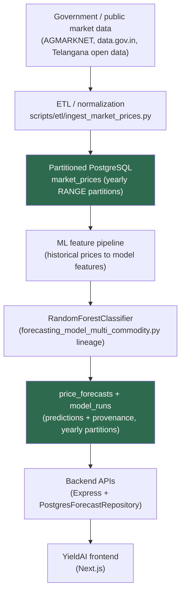
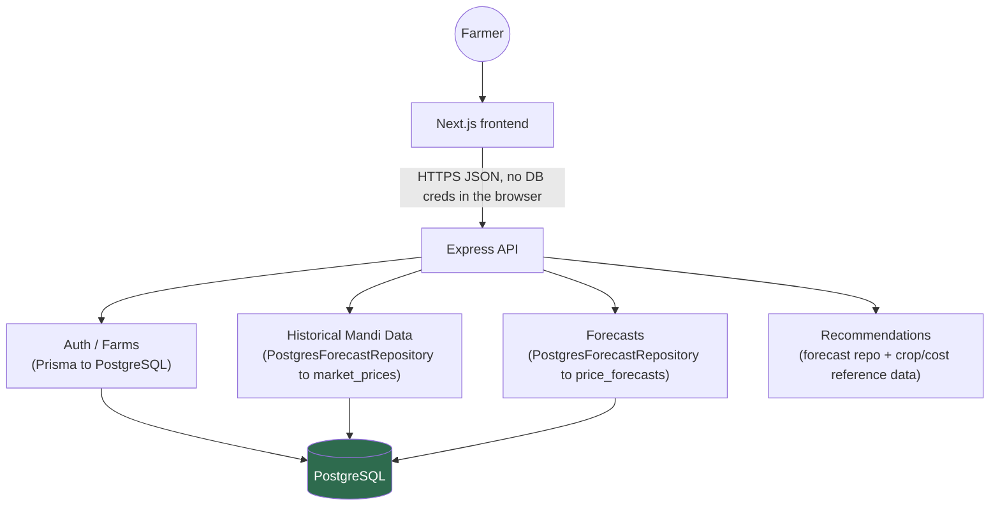

# YieldAI Architecture V2 — Telangana-First, PostgreSQL-Backed

**Audience:** technical stakeholders / investors evaluating the platform's data architecture.
**Status legend used throughout:** 🟢 IMPLEMENTED NOW · 🟡 NEXT DEPLOYMENT STEP · ⚪ FUTURE ARCHITECTURE

---

## 1. Why this document exists

YieldAI's MVP proved the product concept (RandomForest price-trend forecasting + rule-based crop recommendations) on a CSV-based serving path: a data scientist trains a model offline, exports predictions to `forecast_lookup_all_commodities.csv`, and the backend loads that CSV into memory at startup. That path was the right choice to get to a working demo fast. It is the wrong foundation for the next phase, for reasons detailed in §4.

This document describes the replacement: a PostgreSQL-backed, Telangana-first, multi-year architecture, and is explicit about what of it is built today versus what is the next concrete step versus what is intentionally deferred.

---

## 2. Data pipeline architecture

| Stage | Status | Notes |
|---|---|---|
| Government data to ETL | 🟢 for Telangana 2025 (ingestible today from the real `historical_mandi_prices.csv`); 🟡 for 2022-2024 backfill (source verification pending, see `TELANGANA_DATA_SOURCE_RESEARCH.md`) | `scripts/etl/ingest_market_prices.py` |
| Partitioned `market_prices` schema | 🟢 | `backend/db/migrations/002_market_prices.sql`, yearly RANGE partitions 2022-2027 + default |
| ML feature pipeline reading from Postgres | ⚪ | Today's model still trains from the flat historical CSV (Stage A). Retraining directly against `market_prices` is Stage B — see §5. |
| Model training | 🟢 unchanged — RandomForestClassifier, see `~/Yieldmodelling/notebooks/forecasting_model_multi_commodity.py`, outside this repo | Not modified by this migration |
| Predictions to `price_forecasts` + `model_runs` | 🟢 schema + writer script; 🟡 running it against a live database | `backend/db/migrations/003_model_runs.sql`, `004_price_forecasts.sql`, `scripts/ml/persist_predictions.py` |
| Backend reads Postgres | 🟢 code path exists (`PostgresForecastRepository`); 🟡 selected as the active path in a real deployment (requires `DATABASE_URL` + `FORECAST_DATA_SOURCE=postgres`) | `backend/src/repositories/` |
| Frontend | 🟢 unchanged response shapes for existing endpoints; 🟢 new year-aware UI | `frontend/app/(app)/mandi-prices/page.tsx` |

---

## 3. Application architecture

The browser never receives a database connection string or talks to Postgres directly — every data access goes `frontend -> Express API -> repository -> PostgreSQL`. This was already true for `User`/`FarmProfile` (via Prisma) before this migration; it is now equally true for forecast/historical data (via the new repository layer), closing the one path (`csvForecastIndex` reading a flat file) that stood outside a database-backed data-access boundary.

---

## 4. Why this is stronger than the generated-CSV design

| Property | Old (CSV serving) | New (PostgreSQL serving) |
|---|---|---|
| Persistence | A regenerated CSV silently replaces history — no record of what a forecast looked like yesterday | Every prediction is an immutable row tied to a `model_run_id`; nothing is overwritten |
| Auditability | "Why did the app show this number?" has no answer beyond "whatever was in the CSV at the time" | `price_forecasts.model_run_id -> model_runs.trained_through_date` answers exactly which model, trained on data through which date, produced any given number |
| Data lineage | Raw source -> model -> CSV -> memory, with no stage keeping intermediate history | Raw source -> `market_prices` (kept forever, queryable) -> model -> `price_forecasts` (kept forever, queryable) |
| Scalability | Every backend process loads the entire CSV (228MB, ~1.39M rows) into memory at startup; doubling data volume doubles every process's memory floor | SQL does the filtering; the backend only holds query results, and read replicas / connection pooling scale independently of ingestion volume |
| Multi-year queries | Structurally impossible — the CSV is effectively a single current snapshot, not multi-year history | `market_prices` is exactly what "tomato price in Warangal, 2024 vs 2025 vs 2026" requires |
| Model versioning | "v4_multi_commodity" is a string embedded in a JSON metadata file, disconnected from the served data | `model_versions`/`model_runs` are first-class rows the serving layer joins against |
| Queryability | Any new question (e.g. average modal price by district last quarter) means writing new Python offline and regenerating a CSV | Any new question is a SQL query against data already in the database |
| Investor credibility | "We load a spreadsheet into RAM" reads as a prototype | "Partitioned relational warehouse with model provenance" reads as production infrastructure with a clear scaling path |
| Update latency | A new forecast requires regenerating and redeploying a 228MB file | A new forecast is an `INSERT`; the API reflects it on the next read |
| Backend memory at startup | Startup blocks on parsing hundreds of MB before serving any request (`csvForecastIndex.ts`'s own comments document ~10-20MB steady-state only after a full-file scan) | Startup connects a pool; memory scales with concurrent query results, not total historical volume |

This is not implemented to look impressive — every one of these properties maps to a real product question the team asked for (year-by-year comparison, "which model produced this", Telangana-first scaling, developer onboarding without a 228MB file).

---

## 5. Model training: Stage A vs. Stage B

The task explicitly allows a staged migration for the training side, and this implementation takes that path deliberately rather than risking an unsafe rewrite of the trained model pipeline (`~/Yieldmodelling/notebooks/forecasting_model_multi_commodity.py`, outside this repo and not modified):

- **Stage A (🟢 implemented as a script, 🟡 not yet run against a live DB):** existing/raw files -> model (unchanged) -> `scripts/ml/persist_predictions.py` writes the model's output into `price_forecasts`/`model_runs` instead of a CSV. This alone removes the CSV from the serving path — the model's own training code doesn't need to change for that.
- **Stage B (⚪ future architecture):** `market_prices` (Postgres) -> feature generation -> model -> `price_forecasts`. This requires re-architecting the model's feature engineering (currently full-dataset, cross-market pandas operations over the flat CSV) to read from Postgres instead, which is real work the task explicitly says not to force unsafely in one pass. See `docs/POSTGRES_FORECAST_MIGRATION_PLAN.md` for the recommended path.

---

## 6. What "Telangana-first, multi-state-ready" means architecturally

- `states.is_supported` is a boolean column, not a hardcoded `if state === 'Telangana'` scattered through the codebase. Telangana is a row with `is_supported = true`; every other observed state is a row with `is_supported = false`. Adding a second supported state later is a data change (flip the boolean, backfill that state's `market_prices`), not a schema or code change.
- Districts/markets are derived from real ingested rows (via the ETL loader's upsert), never a hand-maintained "supported list" that can drift from what data actually exists.
- The frontend's existing `resolveEffectiveLocation`/`resolveFarmLocationStatus` logic (`frontend/lib/location.ts`) already had the right shape for this (farm > override > default, with an honest `'unsupported'` state) — this migration extends what feeds it, not the logic itself.

---

## 7. Known limitations (see final report for exact figures)

- Real multi-year Telangana data is not yet ingested — the existing raw source (`historical_mandi_prices.csv`) covers 2025 only. See `docs/TELANGANA_DATA_SOURCE_RESEARCH.md` for the recommended backfill sources and the open questions about their actual historical depth.
- No local PostgreSQL/Docker instance was available in this environment, so the schema and repository code are statically reviewed and unit-tested (with mocked connections), not integration-tested against a live database. See the final report for exact test counts and what remains unverified.
- Stage B (training directly against `market_prices`) is designed but not implemented — see §5.
